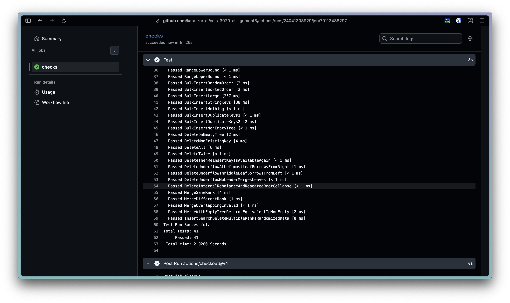

# Testing

For testing we decided to use proper unit tests with `MSUnit`, our tests can be found in `./A3Tests/BPlusTreeTests.cs`. Every time we commit to GitHub our test suite runs it can also be run using `task test` or `dotnet test A3Tests --logger "console;verbosity=detailed"`.

The benefit to unit testing over a regular hand based test document is we can continue to test our code as we make changes very easily this ensures we don't miss any edge cases as we change things.

The full github action run can be found [here](https://github.com/Kara-Zor-El/COIS-3020-Assignment3/actions/runs/24041375283/job/70113703768)

## Testing Results
